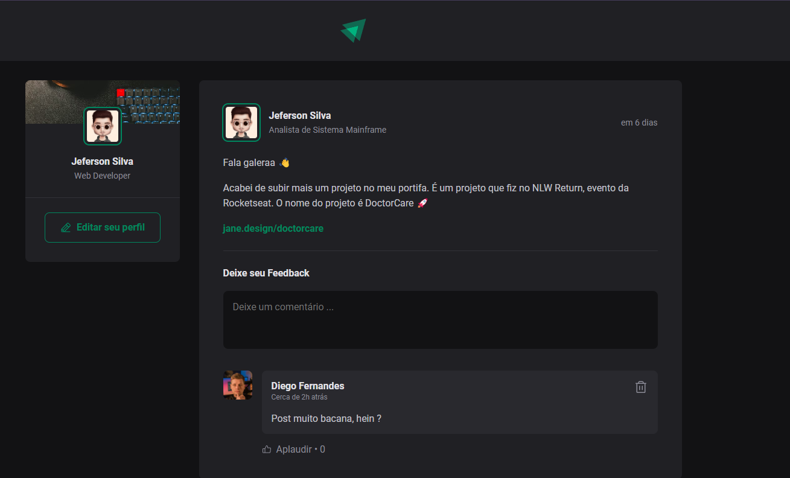

<div align="center">

</div>

<p align='center'><br>
  
</p>

## 💻 Projeto

Este projeto foi desenvolvido durante o bootcamp Ignite da Rocketseat, com foco nas tecnologias ReactJS, React Native e NodeJS. O objetivo é criar uma aplicação de feed de posts, permitindo aos usuários compartilhar e interagir com conteúdos de maneira dinâmica e intuitiva.

## 🧪 Tecnologias

Esse projeto foi desenvolvido com as seguintes tecnologias:

- [ReactJS](https://reactjs.org/)
- [Vite](https://vitejs.dev/)
- [Typescript](https://www.typescriptlang.org/)
- [Date-fns](https://www.npmjs.com/package/date-fns)
- [Phosphor-react](https://phosphoricons.com/)

## 🚀 Instalação

### 1. Clone o repositório e entre na pasta do projeto

```bash
$ git clone https://github.com/sdc-jeferson/01-Ignite-Feed.git
$ cd Ignite-Feed
```

### 2. Instale as dependências

```bash
$ npm install
```

#### ou

```bash
$ yarn install
```

### 3. Execute a aplicação

```bash
$ npm run dev
```

#### ou

```bash
$ yarn start
```

Abra http://localhost:5173 no seu navegador para ver a aplicação rodando!

## 🔖 Layout

- [Layout Web](<https://www.figma.com/file/XUFOgAR5OfvTY8VbA4XvjV/Ignite-Feed-(Community)?node-id=68%3A296&t=ndojrgeD94NXuRwI-1>)

<p align='center'>Devloped by Jeferson 🚀</p>
